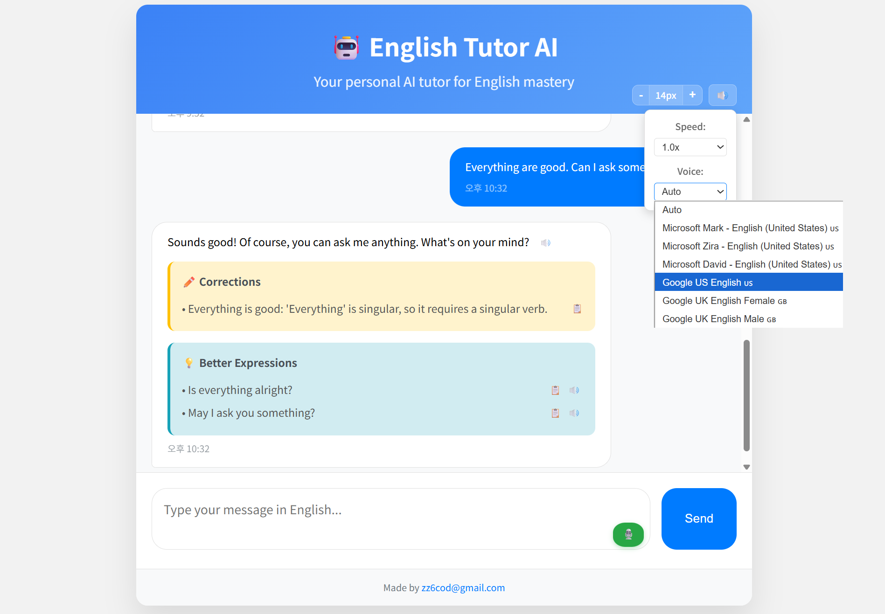
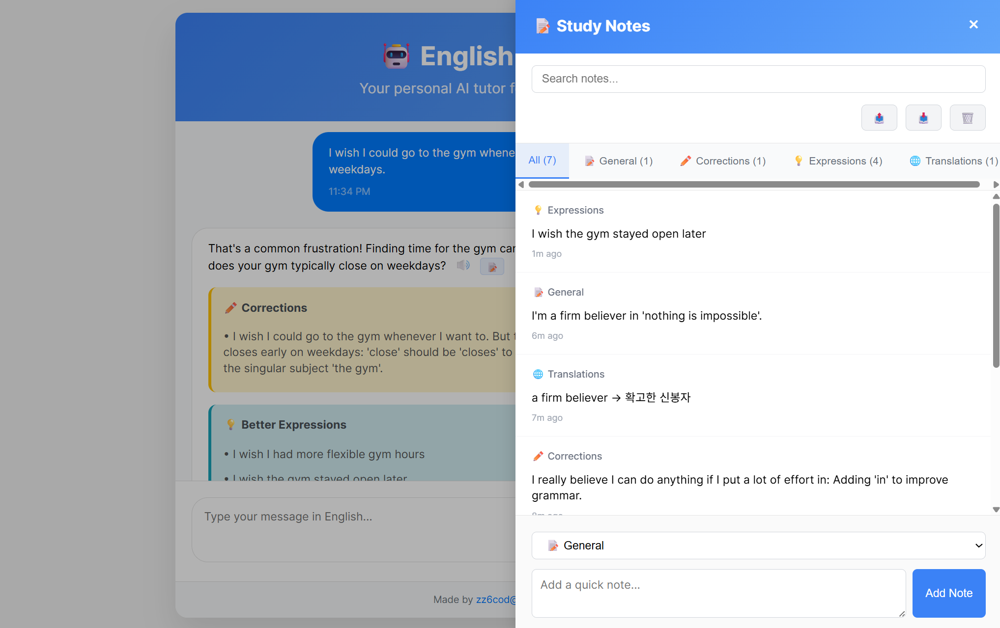

[English](#english) | [한국어](#한국어)

---

# English Tutor AI 🤖 v2.2.0

An AI chatbot that helps improve English conversation skills through real-time grammar correction and expression enhancement.




## 📝 Version History

- **v1.0.0**: Basic text chat and AI grammar correction features
- **v2.0.0**: Voice conversation mode with real-time speech recognition/synthesis
- **v2.1.0**: Speech settings feature - speed control and voice selection options
- **v2.2.0**: One-Click Personal Note panel for saving important expressions and corrections

## ✨ Key Features

### 1. 🎙️ Voice Conversation Feature (NEW!)
- **Real-time Speech Recognition**: Voice-to-text conversion using Web Speech API
- **Automatic Voice Response**: AI responses in natural English speech
- **Continuous Conversation Mode**: Seamless English conversation practice with one voice button
- **Browser Compatibility**: Optimized voice features for Chrome and Safari
- **Intuitive UI**: Mini voice button in text input corner (🎙️ → 🔴)

### 2. Smart Learning Assistant
- **Real-time Grammar Correction**: Detects grammar errors and suggests correct expressions
- **Natural Expression Suggestions**: Recommends more natural and sophisticated English expressions
- **Mixed Language Support**: Responds in English even when you write in Korean, with appropriate English expression recommendations

### 3. User-Friendly Interface
- **Mobile Optimized**: Convenient learning environment on smartphones
- **Header Toggle**: Collapsible header for larger chat view on mobile
- **Font Size Control**: Freely adjust text size according to personal preference
- **Responsive Design**: Optimized display on any device

### 4. 📝 One-Click Personal Note Panel (NEW!)
- **Quick Note Saving**: Save important expressions, corrections, and translations with one click
- **Smart Categorization**: Automatically categorizes notes into General, Corrections, Expressions, and Translations
- **Advanced Search**: Find notes quickly with text search and hashtag support
- **Import/Export**: Backup and restore your notes as JSON files
- **Resizable Panel**: Drag to resize the panel width according to your preference
- **Keyboard Shortcuts**: Use `Ctrl+Shift+N` to quickly toggle the notes panel
- **Auto-Backup Reminders**: Get reminders to backup your notes when you have 20+ saved notes

### 5. Learning Tools
- **Feedback Copy**: Easily copy useful expressions and corrections to clipboard
- **Real-time Analysis**: Receive improvement suggestions and feedback instantly

## 🏗️ Project Structure

```
english-tutor-ai/
├── index.html              # Main page
├── css/
│   └── style.css          # Stylesheet
├── js/                    # JavaScript modules
│   ├── SpeechManager.js   # Speech recognition/synthesis features
│   ├── UIManager.js       # UI control features
│   ├── MessageManager.js  # Chat message handling
│   ├── NoteManager.js     # Personal notes management system
│   └── EnglishChatbot.js  # Main chatbot class
├── resource/
│   └── images/            # Image resources
├── netlify/
│   └── functions/
│       └── gemini.js      # Netlify serverless function
├── .github/
│   └── workflows/
│       └── deploy.yml     # GitHub Actions deployment config
├── netlify.toml          # Netlify configuration
└── package.json          # Project information
```

## 🛠️ Tech Stack

- **Frontend**: HTML, CSS, JavaScript
- **Speech APIs**: Web Speech API (SpeechRecognition, SpeechSynthesis)
- **Backend**: Netlify Functions (Node.js)
- **AI API**: Google Gemini Pro
- **Deployment**: GitHub Pages + Netlify
- **CI/CD**: GitHub Actions

## 🎯 How to Use

### Text Conversation
1. Write a message in English or Korean in the input field
2. Click Send button or press Enter to send
3. Receive grammar corrections and expression improvement feedback from AI

### Voice Conversation (Chrome/Safari recommended)
1. Click the 🎙️ button in the bottom right of the text input field
2. Allow microphone permission and speak **in English only**
3. Speech is automatically converted to text and sent to AI
4. Receive AI responses in both voice and text simultaneously
5. Click 🔴 button to exit voice mode

### Notes Panel Usage
1. Click the 📝 button in chat messages to save notes with one click
2. Use the 📝 icon in the top right to open/close the notes panel
3. Utilize category filtering and search functionality
4. Use note editing, copying, duplicating, and deleting features
5. Use `Ctrl+Shift+N` shortcut for quick panel toggle
6. Systematically manage important expressions and corrections

> **Note**: 
> - Voice features are supported in Chrome and Safari, requiring microphone permission.
> - **Voice mode recognizes English only.** (for improved speech recognition accuracy)
> - Text input supports both Korean and English.
> - It is possible to choose the speed and type of voice.
> - Notes are stored in browser local storage and can be backed up/restored as JSON files.

---

# English Tutor AI 🤖 v2.2.0

실시간 문법 교정과 표현 개선을 통해 영어 회화 실력 향상을 도와주는 AI 챗봇입니다.

## 📝 버전 히스토리

- **v1.0.0**: 기본 텍스트 채팅 및 AI 문법 교정 기능
- **v2.0.0**: 음성 대화 모드 및 실시간 음성 인식/합성 추가
- **v2.1.0**: 음성 설정 기능 - 속도 조절 및 음성 선택 옵션 제공
- **v2.2.0**: 원클릭 개인 노트 패널 - 중요한 표현과 교정사항 저장 기능

## ✨ 주요 기능

### 1. 🎙️ 음성 대화 기능 (NEW!)
- **실시간 음성 인식**: Web Speech API를 활용한 음성-텍스트 변환
- **자동 음성 응답**: AI 답변을 자연스러운 영어 음성으로 출력
- **연속 대화 모드**: 음성 버튼 하나로 끊임없는 영어 회화 연습
- **브라우저 호환성**: Chrome, Safari에서 최적화된 음성 기능
- **직관적인 UI**: 텍스트 입력창 모서리의 미니 음성 버튼 (🎙️ → 🔴)

### 2. 스마트 학습 도우미
- **실시간 문법 교정**: 문법 오류를 감지하고 올바른 표현으로 수정 제안
- **자연스러운 표현 제안**: 더 자연스럽고 세련된 영어 표현 추천
- **한영 혼용 대화**: 한글로 써도 영어로 응답하며 적절한 영어 표현 추천

### 3. 사용자 친화적 인터페이스
- **모바일 최적화**: 스마트폰에서도 편리한 학습 환경
- **헤더 토글**: 모바일에서 채팅창을 더 크게 볼 수 있는 접기/펼치기 기능
- **글씨 크기 조절**: 개인의 선호에 맞춰 텍스트 크기 자유 조정
- **반응형 디자인**: 어떤 기기에서든 최적화된 화면

### 4. 📝 원클릭 개인 노트 패널 (NEW!)
- **빠른 노트 저장**: 중요한 표현, 교정사항, 번역을 원클릭으로 저장
- **스마트 분류**: 일반, 교정, 표현, 번역으로 자동 분류
- **고급 검색**: 텍스트 검색 및 해시태그 지원으로 빠른 노트 찾기
- **가져오기/내보내기**: JSON 파일로 노트 백업 및 복원
- **크기 조절 가능**: 드래그로 패널 너비를 원하는 대로 조절
- **키보드 단축키**: `Ctrl+Shift+N`으로 노트 패널 빠르게 토글
- **자동 백업 알림**: 20개 이상 노트 저장 시 백업 알림 제공

### 5. 학습 도구
- **피드백 복사**: 유용한 표현과 교정 내용을 클립보드로 쉽게 복사
- **실시간 분석**: 메시지를 보내는 즉시 개선점과 제안사항 제공

## 🏗️ 프로젝트 구조

```
english-tutor-ai/
├── index.html              # 메인 페이지
├── css/
│   └── style.css          # 스타일시트
├── js/                    # JavaScript 모듈들
│   ├── SpeechManager.js   # 음성 인식/합성 기능
│   ├── UIManager.js       # UI 컨트롤 기능
│   ├── MessageManager.js  # 채팅 메시지 처리
│   ├── NoteManager.js     # 개인 노트 관리 시스템
│   └── EnglishChatbot.js  # 메인 챗봇 클래스
├── resource/
│   └── images/            # 이미지 리소스
├── netlify/
│   └── functions/
│       └── gemini.js      # Netlify 서버리스 함수
├── .github/
│   └── workflows/
│       └── deploy.yml     # GitHub Actions 배포 설정
├── netlify.toml          # Netlify 설정
└── package.json          # 프로젝트 정보
```

## 🛠️ 기술 스택

- **Frontend**: HTML, CSS, JavaScript
- **Speech APIs**: Web Speech API (SpeechRecognition, SpeechSynthesis)
- **Backend**: Netlify Functions (Node.js)
- **AI API**: Google Gemini Pro
- **Deployment**: GitHub Pages + Netlify
- **CI/CD**: GitHub Actions

## 🎯 사용법

### 텍스트 대화
1. 메시지 입력창에 영어 또는 한글로 메시지 작성
2. Send 버튼 클릭 또는 Enter 키로 전송
3. AI로부터 문법 교정과 표현 개선 피드백 받기

### 음성 대화 (Chrome/Safari 권장)
1. 텍스트 입력창 우측 하단의 🎙️ 버튼 클릭
2. 마이크 권한 허용 후 **영어로만** 말하기
3. 음성이 자동으로 텍스트 변환되어 AI에게 전송
4. AI 응답을 음성과 텍스트로 동시에 받기
5. 🔴 버튼 클릭으로 음성 모드 종료

### 노트 패널 사용법
1. 채팅 메시지의 📝 버튼을 클릭해서 원클릭으로 노트 저장
2. 우측 상단의 📝 아이콘으로 노트 패널 열기/닫기
3. 카테고리별 필터링 및 검색 기능 활용
4. 노트 편집, 복사, 복제, 삭제 기능 사용
5. `Ctrl+Shift+N` 단축키로 빠른 패널 토글
6. 중요한 표현과 교정사항을 체계적으로 관리

> **참고**: 
> - 음성 기능은 Chrome, Safari에서 지원되며 마이크 권한이 필요합니다.
> - **음성 모드에서는 영어만 인식됩니다.** (음성 인식률 향상을 위해)
> - 텍스트 입력 시에는 한글과 영어 모두 사용 가능합니다.
> - 음성 속도와 타입을 선택할 수 있습니다.
> - 노트는 브라우저 로컬 스토리지에 저장되며, JSON 파일로 백업/복원이 가능합니다.